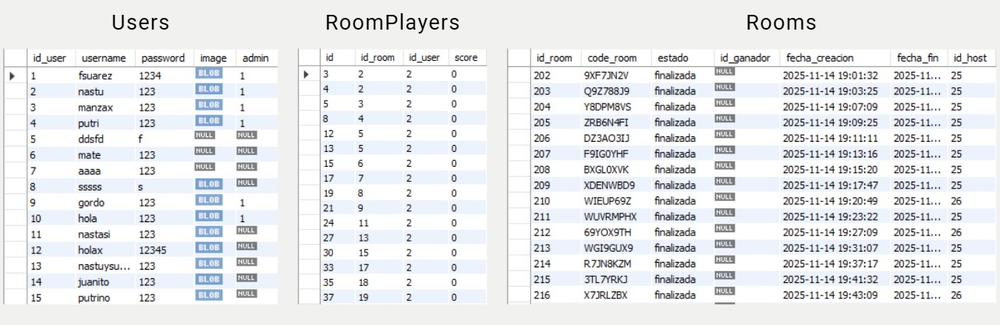

KABEGOL
Football Pio Heads

Integrantes:
Facundo Suarez
Agustin Putrino
Francisco Manzanares
Juan Ignacio Nastasi

La aplicación propuesta consiste en un videojuego multijugador en línea inspirado en el estilo Football Heads. El objetivo principal es ofrecer a los usuarios una experiencia divertida y competitiva, donde cada jugador controle un personaje en un campo de fútbol simplificado, con la posibilidad de moverlo, golpear la pelota y marcar goles en la portería rival.
El acceso a la aplicación se realizará a través de un sistema de registro y login que permitirá a los usuarios crear su perfil, guardar datos personales y seleccionar una foto de perfil. Una vez dentro, podrán crear o unirse a una sala de juego (room), la cual será gestionada mediante sockets para garantizar la comunicación en tiempo real entre los jugadores.
Durante la partida, el sistema llevará el control del tiempo de juego, el marcador y los goles realizados. Al finalizar el encuentro, se registrará el resultado y se determinará el ganador.5
El usuario podrá jugar contra un bot controlado por la computadora. Este bot será programado para reaccionar a la posición de la pelota y al movimiento del rival, brindando un desafío adicional a los jugadores que deseen practicar sin necesidad de otro jugador.
En resumen, la aplicación busca integrar diversión, interacción social y competencia, ofreciendo tanto partidas entre amigos mediante códigos de acceso a salas privadas, como la posibilidad de enfrentarse a un bot.

Tabla Base de datos:

Objetivos:

El desarrollo del proyecto se dividirá en tres grandes etapas para facilitar el control del progreso. En una primera instancia, con una duración estimada de dos semanas, se implementará la base del sistema con el registro y login de usuarios, la carga de sus datos en la base de datos y la posibilidad de crear o unirse a salas de juego mediante códigos generados con Socket.IO. En la segunda etapa, prevista hasta la semana cinco, se avanzará en la programación del juego en tiempo real, desarrollando la cancha, los jugadores, la pelota, la detección de colisiones y goles, el cronómetro y el marcador, de manera que dos usuarios puedan jugar una partida completa y registrar su resultado. Finalmente, en la tercera etapa, con fecha tentativa hasta la semana ocho, se incorporarán las funcionalidades avanzadas, la implementación de un bot y diversas mejoras visuales. De esta forma, se establecen objetivos parciales claros que permiten ir midiendo el avance del grupo en cada fase del trabajo.
